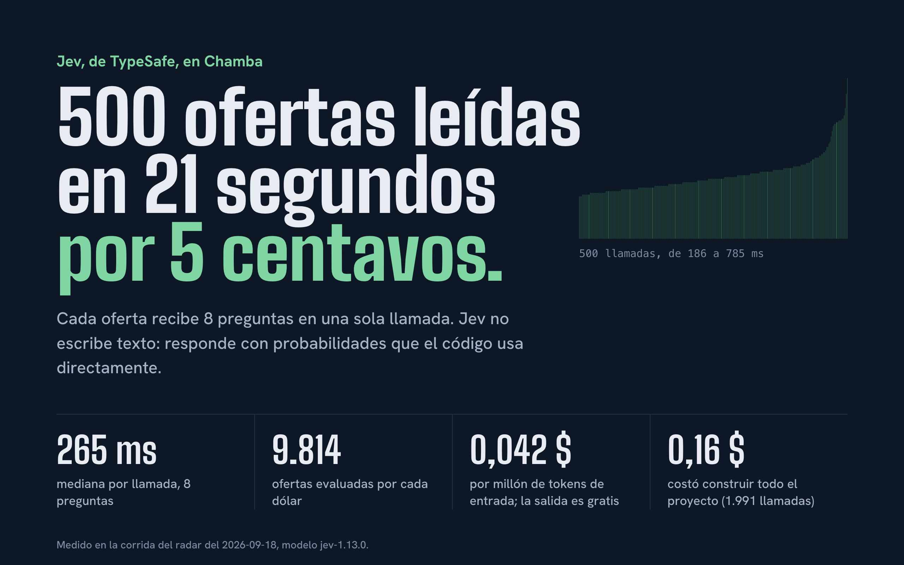
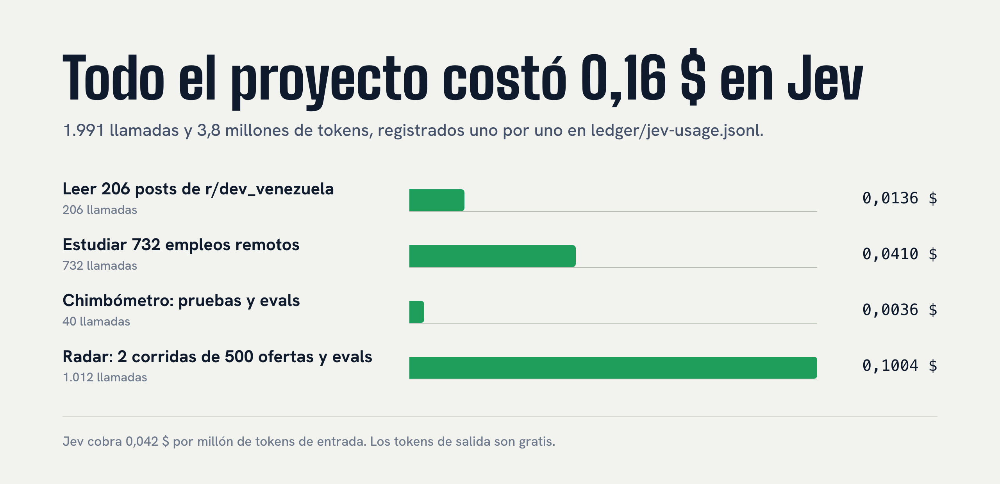

# Chamba

**Español** | [English](README.md)

Empleos remotos de tecnología que sí aceptan gente que vive en Venezuela, más un medidor de
ofertas chimbas. Hecho para [r/dev_venezuela](https://www.reddit.com/r/dev_venezuela/) con
[Jev](https://docs.typesafe.ai), el modelo System One de TypeSafe.

En vivo: [chimbometro.vercel.app](https://chimbometro.vercel.app)<br>
Cómo se hizo: [el Laboratorio](https://chimbometro.vercel.app/docs)


## Por qué Jev



Jev no escribe texto. Responde preguntas con tipo (sí o no, escoge una opción, puntúa en una
escala) y devuelve probabilidades. Eso cambia cuánto cuesta y cómo se comporta una función con IA:

- **Tan rápido que cabe en un request.** Una llamada del radar le hace 8 preguntas a una oferta y
  responde en 265 ms (mediana de 500 llamadas). Una del Chimbómetro hace 20 y tarda menos de un
  segundo.
- **Tan barato que se puede correr sobre todo.** A 0,042 $ por millón de tokens de entrada, y con
  la salida gratis, un dólar alcanza para evaluar unas 9.800 ofertas. La actualización diaria del
  radar cuesta centavos.
- **Fácil de verificar.** Las respuestas son números y opciones, así que el código aplica los
  umbrales y muestra la incertidumbre. La evidencia se escoge entre frases que existen en la
  oferta, así que una cita no se puede inventar. Jev igual se puede equivocar: por eso cada
  resultado enlaza a la oferta original y los casos difíciles corren como evals.

## Por qué Chamba

Casi nunca "remoto" significa remoto desde Venezuela. Muchas ofertas piden permiso de trabajo en
EE. UU., una licencia local o vivir en una lista corta de países, y uno se entera después de leer
todo el aviso. Antes de escribir código, Jev leyó 206 posts de r/dev_venezuela: conseguir chamba
es lo que más duele, y dos de los seis posts con más votos en la historia del sub son capturas de
ofertas absurdas. Chamba ataca las dos cosas.

## Qué hace

### Radar de empleos

Todos los días, y cada vez que un visitante lo pide, el servidor trae unas 500 ofertas de cuatro
bolsas públicas: el "Who is hiring?" de Hacker News, Get on Board, We Work Remotely y Remotive. A
cada oferta nueva Jev le responde ocho preguntas en una sola llamada: si es un empleo de verdad, si
es de tecnología, dónde puede vivir la persona contratada, si pide algo que alguien en Venezuela no
tendría (permiso de trabajo, una licencia de EE. UU., una credencial de seguridad), si paga en
dólares, el nivel, el rol y el inglés que exige. Además escoge la frase que demuestra dónde se
puede trabajar, así que cada resultado muestra su evidencia y enlaza a la oferta original.

Cualquiera puede ver una actualización en vivo: la página transmite cada URL que pide el servidor
y cada oferta que Jev evalúa, con los tokens y el costo sumando en tiempo real.


### Chimbómetro

Pegas una oferta y en menos de un segundo te da un puntaje de 0 a 100. Una sola llamada le hace 20
preguntas a Jev: nueve banderas rojas, qué tan injusta es en general, un veredicto y, por cada
bandera, el fragmento de la oferta que la activó. El puntaje lo calcula código simple y ajustable.
El resultado se comparte con un enlace y una tarjeta de vista previa; el texto de la oferta nunca
se guarda.


| Resultado compartido | Tarjeta del radar |
| --- | --- |
|  |  |

### Laboratorio

Una explicación pública de cómo se construyó el proyecto con Jev: la arquitectura, cada pregunta
tal como se envía, un playground que recalcula respuestas guardadas con tus propios pesos, el
protocolo de streaming, la seguridad, gráficos de latencia y costo, y los errores que se cometieron
en el camino.


### En el teléfono


## Cuánto costó construirlo



Cada llamada a Jev hecha durante el desarrollo está registrada en
[`ledger/jev-usage.jsonl`](ledger/jev-usage.jsonl): la investigación, cada eval, cada prueba local
y las dos corridas completas del radar. La página del Laboratorio muestra los mismos totales, y
`npm run readme:art` vuelve a dibujar estos gráficos a partir del ledger y de la última corrida.

| | |
| --- | --- |
| Gasto total en Jev | **0,16 $** en 1.991 llamadas y 3,8 millones de tokens de entrada |
| Leer 206 posts del sub (investigación) | 0,014 $ |
| Una medición del Chimbómetro | unos 0,00015 $, 20 preguntas, menos de un segundo |
| Una corrida completa del radar (500 ofertas, 4.000 preguntas) | 0,051 $, 20,5 s |
| La actualización diaria del radar | solo se evalúan las ofertas nuevas, así que cuesta centavos |

## Cómo funciona

```
navegador ──POST──▶ /api/chimba ──▶ guardia (origen, tamaño, presupuesto, límites en Redis)
                                  ──▶ Jev: 20 preguntas con tipo, una llamada
                                  ──▶ score.ts: la fórmula, código simple
          ◀── stream NDJSON: recibido, enviado, respondido, puntuado

cron / visitante ──▶ /api/radar/refresh ──▶ 4 APIs y feeds públicos de empleos
                                          ──▶ Jev: 8 preguntas por oferta nueva, 8 a la vez
                                          ──▶ snapshot en Redis ──▶ página del radar (ISR, 60 s)
```

Decisiones que vale la pena conocer:

- **Los datos estructurados los decide el código.** Si la fuente dice la ubicación en un campo (la
  modalidad remota de Get on Board, "Anywhere in the World"), decide el código y Jev solo juzga
  texto libre.
- **Seleccionar, no generar.** La evidencia es una opción entre fragmentos que existen en la
  oferta, así que una cita no se puede inventar.
- **La duda se muestra.** Las ubicaciones con poca confianza salen marcadas "Por confirmar".
- **Los evals cuidan las preguntas.** `npm run jev:eval` y `npm run jev:eval-radar` pasan casos
  difíciles por el modelo real. Los del radar incluyen cada error encontrado en producción, como
  un empleo de seguros "100 % remoto" que pedía licencia de EE. UU.
- **La key nunca llega al navegador**, y la API falla cerrada: chequeo de origen, límite de 32 KB
  por request, tope de gasto diario y límites por IP y globales en Upstash Redis. Las IP se guardan
  con hash.

## Correrlo en local

```sh
cp .env.example .env    # TYPESAFE_API_KEY desde console.typesafe.ai
npm install
npm run jev:check       # verifica la key con una llamada pequeña
npm run dev             # http://localhost:3000
```

En local los límites usan memoria, así que el desarrollo nunca toca datos de producción. Pon
`CHIMBA_DEV_REDIS=1` para usar a propósito las credenciales de Redis de `.env.local`.

| Script | Qué hace |
| --- | --- |
| `npm run check` | Typecheck, lint y 80 pruebas unitarias |
| `npm run jev:eval` | Veredictos del Chimbómetro con ofertas de ejemplo |
| `npm run jev:eval-radar` | Juicios del radar con 12 ofertas difíciles |
| `npm run readme:art` | Vuelve a dibujar las imágenes del README desde el ledger y la última corrida |
| `npm run build` | Build de producción |

Cada script que llama a Jev anota su costo en el ledger.

## Estructura

```
src/
  app/                    páginas, rutas de la API, imágenes de vista previa (Open Graph)
  components/             radar, Chimbómetro, secciones del Laboratorio, marca
  lib/radar/              fuentes, preguntas, juez, actualización, casos de eval
  lib/chimba/             preguntas, evidencia, fórmula, compartir
  lib/jev/                cliente HTTP con tipos y precios (sin SDK)
  lib/server/             guardia, Redis, configuración del servidor
research/                 scripts de Python que analizaron el sub y el mercado de empleos
ledger/jev-usage.jsonl    cada llamada a Jev hecha durante el desarrollo, con su costo
```

## Stack

Next.js 16, React 19, TypeScript, CSS Modules, Upstash Redis, Vercel. Sin kit de UI: el sistema de
diseño son unos pocos tokens en `globals.css`, con Big Shoulders, Hanken Grotesk e IBM Plex Mono.

## Autor

Hecho por [elberacasa](https://github.com/elberacasa). Sin afiliación con TypeSafe AI.

## Licencia

[MIT](LICENSE)
