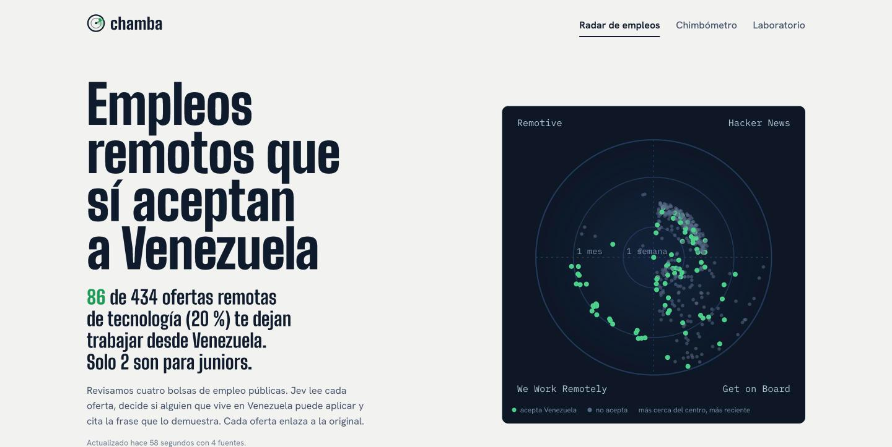
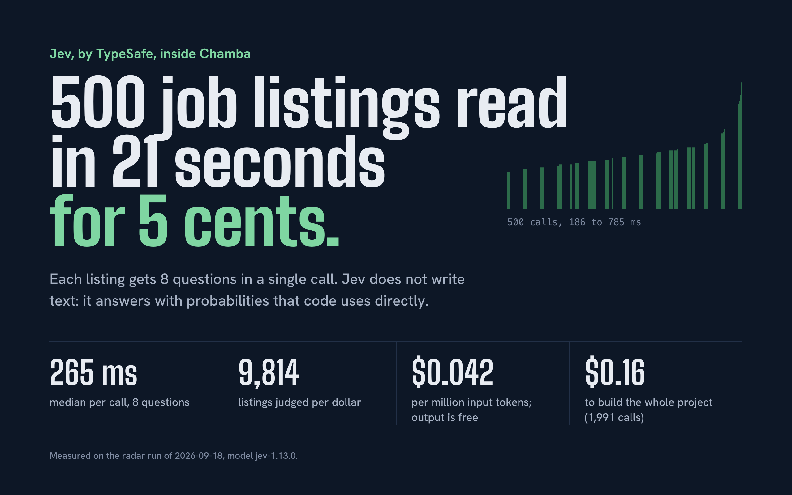
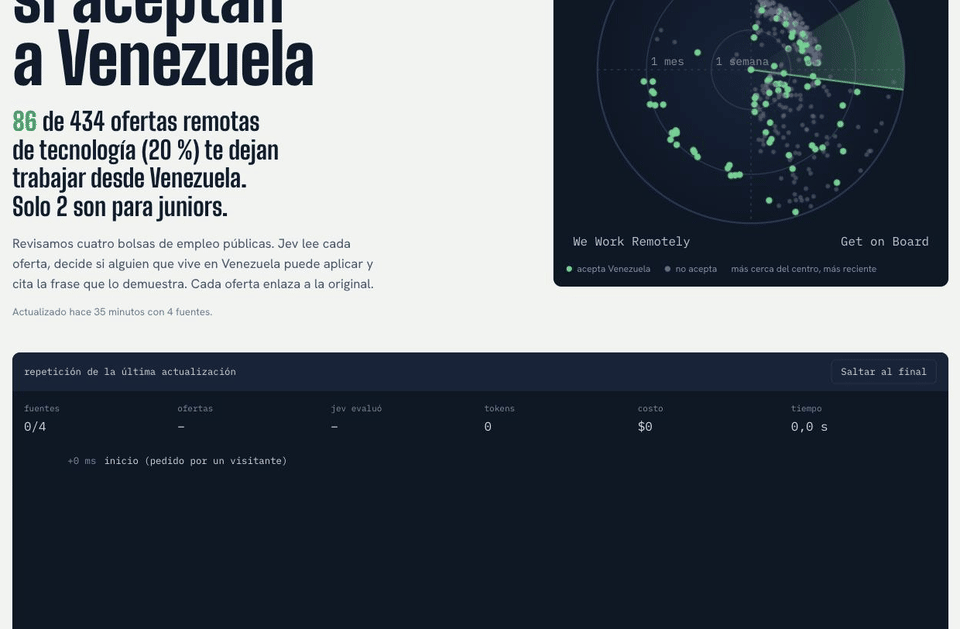
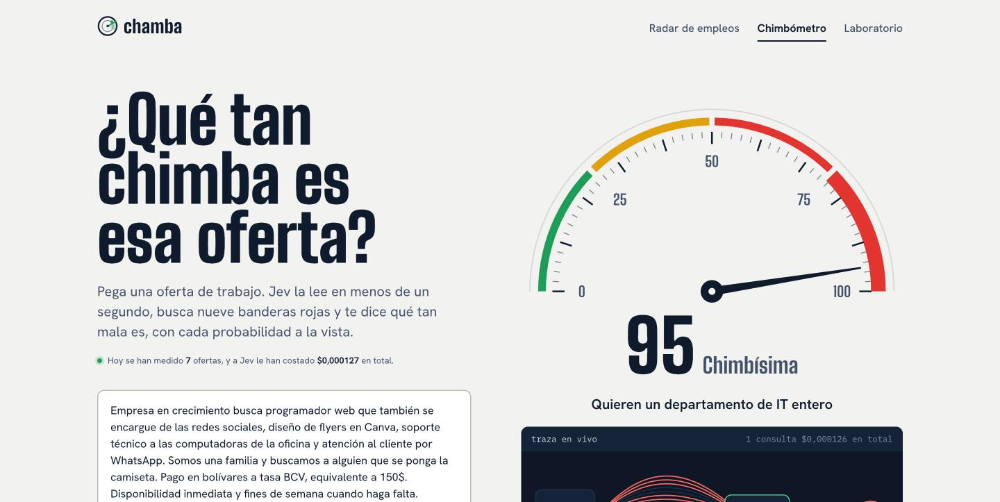
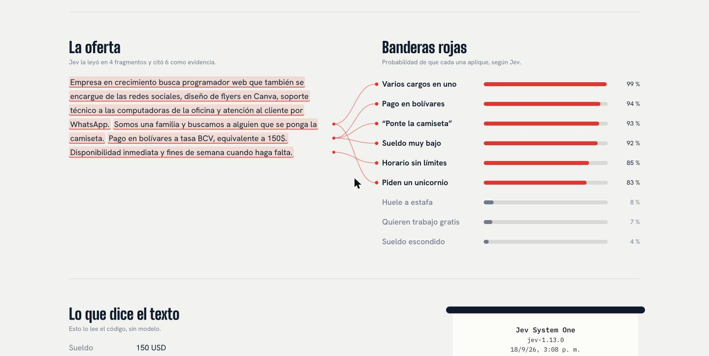
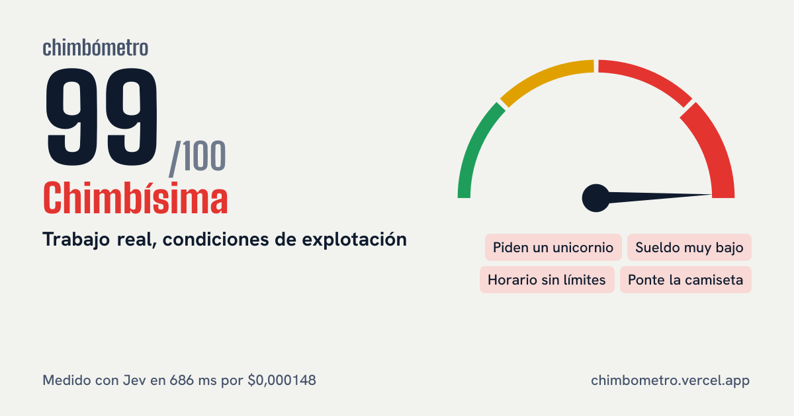
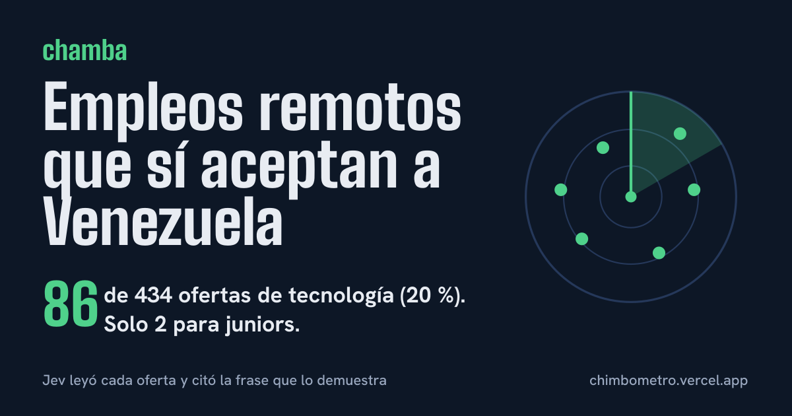
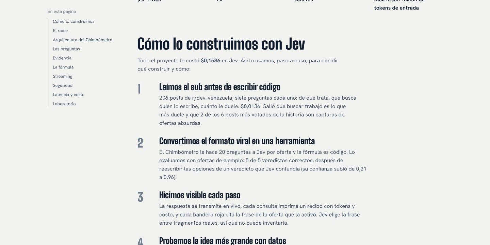
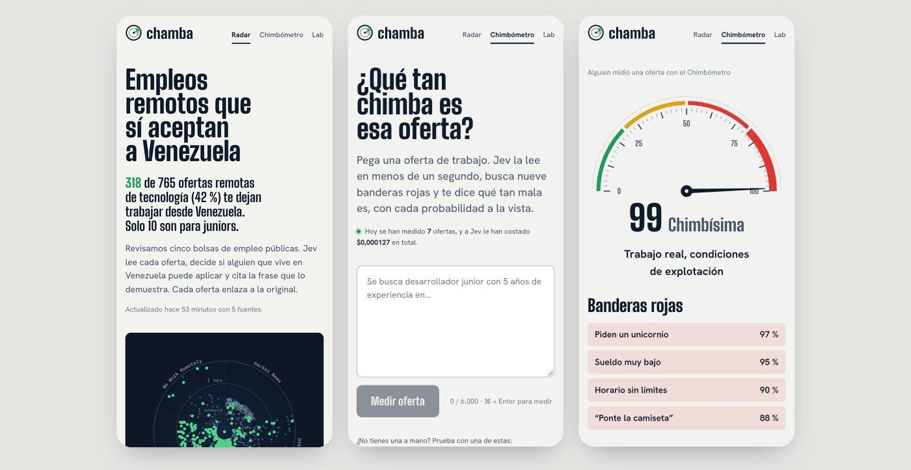
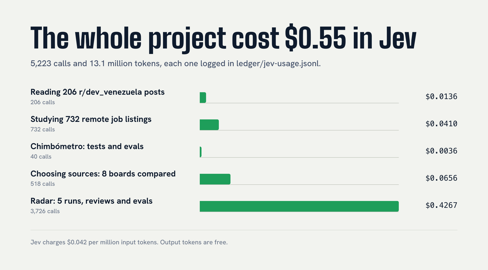

# Chamba

[Español](README.es.md) | **English**

Remote tech jobs that actually accept people living in Venezuela, plus a meter for absurd job
offers. Built for [r/dev_venezuela](https://www.reddit.com/r/dev_venezuela/) on top of
[Jev](https://docs.typesafe.ai), TypeSafe's System One model.

Live: [chimbometro.vercel.app](https://chimbometro.vercel.app)<br>
How it was built: [the Laboratorio](https://chimbometro.vercel.app/docs)



## Why Jev



Jev is a System One model: instead of writing text, it answers typed questions (yes or no, pick
one, score on a scale) with probabilities. That changes what an AI feature costs and how it
behaves:

- **Fast enough to run in a request.** A radar call asks 9 questions about one listing and returns
  in 275 ms (median of 874 calls). A Chimbómetro call asks 20 and still finishes in under a second.
- **Cheap enough to run on everything.** At $0.042 per million input tokens and free output, one
  dollar judges about 8,000 job listings. The daily radar update costs a few cents.
- **Easy to check.** Answers are numbers and choices, so code applies the thresholds and shows
  the uncertainty. Evidence is picked from sentences that exist in the listing, so a citation
  cannot be invented. Judgments can still be wrong, which is why every one links to its source
  and the tricky cases run as evals.

## Why Chamba

"Remote" rarely means remote from Venezuela. Most listings quietly require US work authorization,
a local license, or residence in a short list of countries, and you only find out after reading
the whole post. Before writing any code, Jev read 206 posts from r/dev_venezuela: finding work is
the topic that hurts the most, and two of the six most upvoted posts ever are screenshots of
absurd job offers. Chamba addresses both.

## What it does

### Job radar

Every day, and whenever a visitor asks for it, the server fetches around 900 listings from five
public job boards: Hacker News "Who is hiring?", Get on Board, Himalayas, Jobicy and We Work
Remotely. For each new listing Jev answers nine questions in a single request: is it a real job,
is it a tech role, where can the hired person live, does it require something a person in
Venezuela would not have (work authorization, a US license, a clearance, a time zone), does it take
juniors, USD pay, seniority, role and English level.
It also picks the sentence of the listing that proves where the job can be done, so every result
shows its evidence and links to the original.

Anyone can watch an update live: the page streams every URL the server requests and every
listing Jev judges, with tokens and cost adding up in real time.



### How the sources were chosen

The first radar read four boards because they were the ones we knew. To choose better, Jev read
the 80 newest listings of eight public boards (`npm run jev:sources`, 518 listings, $0.066) and we
measured what matters to someone job hunting from Venezuela: how many tech jobs accept them, and
what each one costs to find.

| Board | Tech jobs | Accept Venezuela | Cost per useful job | |
| --- | ---: | ---: | ---: | --- |
| Himalayas | 67 | 64 | $0.00016 | kept |
| Jobicy | 75 | 45 | $0.00025 | kept |
| We Work Remotely | 62 | 42 | $0.00027 | kept |
| Get on Board | 59 | 15 | $0.00062 | kept |
| Hacker News | 74 | 11 | $0.00073 | kept |
| Working Nomads | 26 | 3 | $0.00117 | dropped |
| Remotive | 9 | 1 | $0.00141 | dropped |
| Remote OK | 34 | 5 | $0.00210 | dropped |

The radar went from 86 of 434 tech jobs that accept Venezuela to 342 of 760, and from 2 jobs open
to juniors to 12. Every board is fetched at most once per the interval its API terms ask for.

### How Jev gets better

Where a board states the location in a field, code decides. The experiment also had Jev read the
text on its own and saved every disagreement: 85 of them, reviewed one by one. Sometimes the board
was wrong ("Anywhere in the World" in the field, "within one hour of CET" in the text), so Jev's
exclusion question always applies. Sometimes Jev was wrong, and that changed the questions.

Every real mistake goes the same way: it becomes an eval case, the question changes, and
`npm run jev:eval-radar` runs all cases against the real model before the radar re-reads
everything with the new version.

| Version | Found by | What was wrong | Eval cases |
| --- | --- | --- | ---: |
| 2 | A user | A US-licensed insurance sales job showed up as a junior tech role | 12 |
| 3 | Auditing the 86 accepted jobs | "Junior and Senior" posts counted as unclear; "NAMER, EMEA, APJ" read as worldwide | 15 |
| 4 | Comparing boards | "LATAM, USA" and standard work-authorization text read as exclusions; CET-only hours barely caught | 19 |
| 5 | Reviewing the juniors | Boards tagged "expert senior engineers wanted" as entry-level | 20 |

All 20 cases pass. One is still open and documented: a "LATAM, USA" listing whose standard
authorization line keeps it just over the exclusion threshold (0.51).

### Chimbómetro

Paste a job offer and get a 0 to 100 score in under a second. One request asks Jev 20 questions:
nine red flags, overall unfairness, a verdict, and for each flag the fragment of the offer that
triggered it. The score itself is plain, tunable code. Results can be shared as a link with a
preview card; the offer text is never stored.





| Shared result card | Radar card |
| --- | --- |
|  |  |

### Laboratorio

A public write-up of how the project was built with Jev: the architecture, every question exactly
as it is sent, a playground that re-scores saved answers with your own weights, the streaming
protocol, security, latency and cost charts, and the mistakes made along the way.



### On a phone



## What it cost to build



Every Jev call made while building the project is recorded in
[`ledger/jev-usage.jsonl`](ledger/jev-usage.jsonl): the research, every eval, every local test
and every full radar run. The docs page renders the same totals, and `npm run readme:art` redraws
the charts above from the ledger and the last radar run.

| | |
| --- | --- |
| Total Jev spend | **$0.44** across 4,325 calls and 10.5M input tokens |
| Reading 206 subreddit posts (research) | $0.014 |
| Comparing eight job boards (518 listings) | $0.066 |
| One Chimbómetro measurement | about $0.00015, 20 questions, under a second |
| A full radar run (874 listings, five boards) | $0.107, 34 s |
| A daily radar update | only new listings are judged, so it costs cents |

## How it works

```
browser ──POST──▶ /api/chimba ──▶ guard (origin, size, budget, rate limits in Redis)
                                 ──▶ Jev: 20 typed questions, one request
                                 ──▶ score.ts: the formula, plain code
        ◀── NDJSON stream: received, sent, answered, scored

cron / visitor ──▶ /api/radar/refresh ──▶ 5 public job APIs and feeds
                                        ──▶ Jev: 9 questions per new listing, 8 at a time
                                        ──▶ snapshot in Redis ──▶ radar page (ISR, 60 s)
```

Decisions worth knowing:

- **Structured data is decided in code, and checked by Jev.** When a board states the location or
  the level in a field, code decides. Jev's exclusion question still applies, and a "junior" field
  loses when the text clearly says otherwise: fields are sometimes just defaults.
- **Select, don't generate.** Evidence is a choice among fragments that exist in the listing, so a
  citation cannot be invented.
- **Uncertainty is shown.** Low-confidence location judgments are marked "Por confirmar".
- **Evals guard the questions.** `npm run jev:eval` and `npm run jev:eval-radar` run tricky cases
  through the real model. The radar cases include every mistake found in production, such as a
  "fully remote" insurance job that required a US license.
- **The key never reaches the browser**, and the API fails closed: same-origin check, 32 KB body
  cap, a daily spend cap, and per-IP and global rate limits in Upstash Redis. IPs are stored hashed.

## Run it locally

```sh
cp .env.example .env    # TYPESAFE_API_KEY from console.typesafe.ai
npm install
npm run jev:check       # verify the key with one small request
npm run dev             # http://localhost:3000
```

Locally, rate limits use memory, so development never touches production data. Set
`CHIMBA_DEV_REDIS=1` to use the Redis credentials from `.env.local` on purpose.

| Script | What it does |
| --- | --- |
| `npm run check` | Typecheck, lint and 88 unit tests |
| `npm run jev:eval` | Chimbómetro verdicts on example offers |
| `npm run jev:eval-radar` | Radar judgments on 20 tricky listings, most of them real mistakes |
| `npm run jev:sources` | Compare the candidate job boards with Jev |
| `npm run radar:refresh` | A full radar update into memory, saved for review; `-- --publish` sends it live |
| `npm run readme:art` | Redraw the README images from the ledger and the last run |
| `npm run build` | Production build |

Every script that calls Jev appends its cost to the ledger.

## Project layout

```
src/
  app/                    pages, API routes, preview images (Open Graph)
  components/             radar, Chimbómetro, docs sections, brand
  lib/radar/              sources, questions, judge, refresh, eval cases
  lib/chimba/             questions, evidence, formula, sharing
  lib/jev/                typed HTTP client and pricing (no SDK)
  lib/server/             guard, Redis store, server-only config
research/                 Python scripts that analyzed the subreddit and the job market
ledger/jev-usage.jsonl    every Jev call made while building, with its cost
```

## Stack

Next.js 16, React 19, TypeScript, CSS Modules, Upstash Redis, Vercel. No UI kit: the design
system is a handful of tokens in `globals.css`, set in Big Shoulders, Hanken Grotesk and IBM Plex
Mono.

## Author

Built by [elberacasa](https://github.com/elberacasa). Not affiliated with TypeSafe AI.

## License

[MIT](LICENSE)
